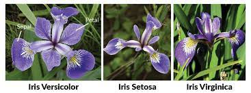
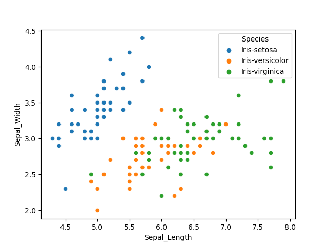
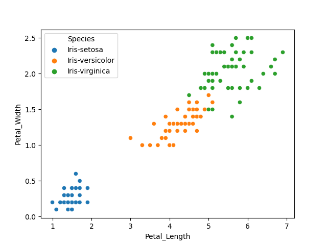
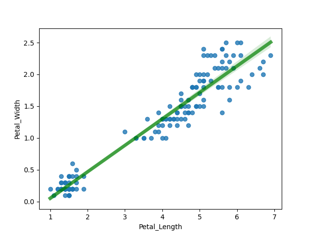
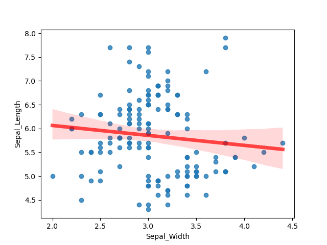
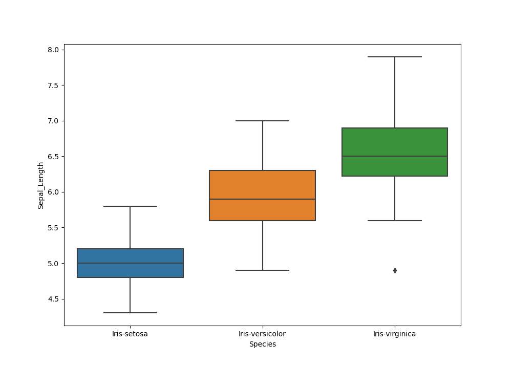
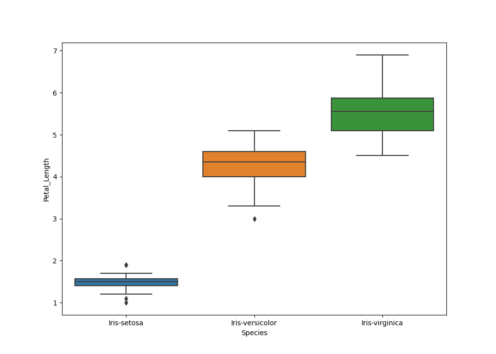

# **PANDS PROJECT 2023**  

## **TABLES OF CONTENTS**  

  - [Project Brief](#project-brief)
  - [Iris Data Set Summary](#iris-data-set-iris-summary)
  - [Python](#python)
  - [Data Analysis](#data-analysis)
    - [Applications Used](#applications-used)
    - [Libraries Used](#libraries-used)
    - [Dataset Download and Import](#dataset-download-and-import)
    - [Summary of each variable](#summary-of-each-variable)
    - [Histogram of each variable type](#histogram-of-each-variable-type)
    - [Scatterplots of each Pair of Variables](#scatterplots-of-each-pair-of-variables)
  - [Further Analysis](#further-analysis)
    - [Pearson Correaltion ](#pearson-correaltion)
    - [Linear Regression](#linear-regression)
    - [Boxplots](#boxplots)
  - [Supervised Machine Learning](#supervised-machine-learning)
  - [Conclusion](#conclusion)
- [References](#references)

## Project Brief:

**Problem statement:**

This project concerns the well-known Fisher’s Iris data set. You must research the data set
and write documentation and code in Python to investigate it. Research the data set online and 

[1] Reseach the data set and write a summary about it in your README.

[2] Download the data set and add it to your repository.

[3] Write a program called analysis.py that:

- outputs a summary of each variable to a single text file
- saves a histogram of each variable to png files
- outputs a scatter plot of each pair of variable
- performs other appropriate analysis  

Note: Imagine that this project is used to explain to work collagues what investigating a data set entails and how python can be use to do it.  

## Summary of Fisher's Iris Data Set.

A data set is any organised collection of data. The data set lists values for each of the variables and for each member of the dataset.  

The Fisher Iris Data Set is multivariate dataset. The data set  is the measurement of the length and width of both sepals and petals of three different species of the Iris flower (Setosa, Versicolor and Virginica) . In total there are 150 measurements. These measures were used to create a linear discriminate model to classify the species [1]. 

It is one of the most widely used data sets for mining data, exploratory data analtyics and testing machine learning alogorithims.  This is for several reasons: 
-   It is a simple and easy to understand  
-   The features of the dataset are well understood
-   The classification of the three species of Iris is well defined ans they can be discrimated between using the measurements of their petals and sepals

This makes it easy to work with in data science, especially for beginners. [2]

 
## PYTHON:  

Python is a popular multipurpose programming language created in 1991. It has many uses, mainly :  

-   web development e.g used on server to create web application 
-   software development e.g. rapid prototyping
-   mathematics e.g. handle big data and perform complex statisical analysis
-   system scripting e.g. write programs, manipulate, customize, and automate the facilities of an existing system

Python works on different platforms (Windows, Mac, Linux, Raspberry Pi, etc) and has a simple syntax similar to the English language. This synthax allows developers to write write programs with fewer lines than some other programming languages.The code can be executed as soon as it is written as it runs on an interpreter system [4].

## DATA ANALYSIS

### Applications used  

**Anacona3 Python version 3.9.13**
Anaconda is an open source software package distribution of the Python programming language. The distribution includes data-science packages suitable for Windows, Linux, and macOS. I installed anaconda on my Windows machine to use the Python language to create code for this project which was very useful because of the inbuilt data science packages and libraries.  

**VSCODE version 1.78**  

Visual Studio code is a freeware source code editor which runs on your desktop and is available for Windows, macOS and Linux. It comes with built-in support for languages like JavaScript and has a system of extensions for other programming languages like Python. All the code for this project was written using VS Code.

**CMDER version 1.3.21**  

CMDER is an open source command prompt user interface for Windows machines. It is more popular that in built command prompt interfaces as it provides more graphical representtation.  I installed CMDER on my windows machine to clone my repository for the project from git hub and saved it to a folder on my Desktop.

**GITHUB version 3.74**  

GitHub is a website and cloud-based service that helps developers store and manage their code, as well as track and control changes to their code.  I used this application to store my code for this project aslong with the read.me file.  

### Libraries Used  

In VS code I imported the following libraries as tools to help me analyse and visuailse the Iris data set. A brief overview is provided below [5].    

**_Numpy_**  

NumPy is a Python module for numerical computation that can process large amounts of data and perform array computations. It can deal with  multi-dimensional arrays. It provides a wide range of mathematical functions for performing common operations such as addition, subtraction, multiplication, division, and more.

**_Matplotlib_**  

Matbotlib is a visualization package that is used to plot graphs and charts. It is frequently utilized for data analysis due to the charts and histograms that it generates that assist with communication of data. data to a non-technical person. It is useful for exploaratory data anaylysis in helping identift trends in the data. 

**_Pandas_**  

Pandas is a popular data science library processing and manipulating data set. It provides a range of functions for data manipulation, data analysis, and data visualization. 
 

**_Seaborn_**   

It is a  Matplotlib-based package used to make  high level visualizations for displaying statistical data. 

**_Sklearn_**  
 This is a free software machine learning library for the Python programming language.  It features various classification, regression and clustering algorithms. It is designed to work with the Python numerical and scientific libraries.  

### Dataset Download and Import  

I downloaded the Iris dataset from the data folder on the UCI Machine Learning Respository[5] through vs code in csv format and then saved in my pands-project folder on my desktop.  

I used the pandas library to import the data file as a dataframe object.  A pandas dataframe represents a rectangular table of data containing an ordered collection of columns and each column can have a different value type. The Iris data set contains four numerical columns for the petal and sepal measurements and one categorical column for the species of iris.

The pandas *read_csv* function loads delimited data from a file using the comma as the separator and creates a DataFrame object. *read_csv* has different options for specifying the column names to use. If column names are not passed to read_csv, by default it looks to the first row of the data and infers the column names from this row. In the case of iris data set from UCI the column names are not specified. Therefore I created a variable dict to name the columns and passed it in as an argument to the *read_csv*.  

 

## Summary of each varialble  

The first and last 5 rows of the iris dataframe are visualised using the methods *df.head()* and *df.tail()* respecticely.  The data types were checked using *dtypes()* function. The *print* function outputed the data to the termminal.

### df.head()  

### df.tail()  

### df.dtypes()  

From this function the different column names can be seen and their respective data types (four numerical 'float' and one non-numberical 'object').  

### with open , df.describe()

To work with the data file in python I have to open it first. However if I used the *open* function on it's own I will have to close it using *close* function each time. Instead I used the *with* statement in conjuction with *open* function to close withput instruction. The filename and the mode are the 2 parameters in the open function [6]

The *df.describe()* function was used to compute  basic statistical computations on the iris data set. It gives a good picture of the distribution of the data. 

The *df.describe()* function returns as a panda dataframe. I initially used the *print()* function to display in the terminal. After reaserch I revised my code to use the *write()* method along with *df.describe()* to write to a text file (iris.txt). To use this method I had to convert the df to string using the *to_string()* method.  

The total count, mean, standard deviation, min value, max value and 25%, 50% and 75% values were computed for the four varianbles. This gives a statistical summary for all the data values but is not species specfic. 

### df.value_counts()

I used the *series.value.counts()* function to see the different types of species and the count of each of them. This was written to a text file iris_species.txt. There are three different species in the data set and there are equal numbers of each (n=50)  

### df.describe for each species  

I separated the dataframe into each species type to get a breakdown of statistics by species using the *df.describe()* function and wrote to the iris_species_sum.txt.  

### Histogram of each variable type  

I used the Matplotlib pacakage to create histograms for each of the five variables in the Iris data set (Species, Sepal_Length, Sepal_Width, Petal_Length, Petal_Width) [7,8].  

The histograms are used to represent the frequency distribution of the variables. The width of the histogram represents interval and the length represents frequency. They allow the inspection of data for it's underlying distribution, outliers, skewness.  

The histograms per variable showed that the Sepal length and width follow a mainly normal distribution. The majority of iris's have a sepal lenght of between 2cm and 5 cm and a sepal width of between 2.5cm to 3.8cm. 

The Petal_length plot indicates that the majority of iris flowers have a petal length between 1.0 and 1.8, with fewer flowers having shorter or longer petals. The petal_width plot shows that values are mostly concentrated between 0.1 to 0.8. There are irises with larger petal width, but they are much less frequent. 
[2]. Overall the histograms give us an overview of the characterustics of the five variables and an idea on further analysis.

  

  

### Scatterplots of each Pair of Variables   

Scatterplots use dots to represent the values of two different set of variables. Each dot on the x,y axis represents a indiviual data point, in this case individual flower.  I used the Seaborn package to create the scatterplots to visualise the relationship or correlation between each pair of variables (sepal length vs width and petal length vs width).  The colour of the dots were used to distinguish betweeen the the  three species. [10,11].   THe x  axis represents the lenght in cm and the y-axis the width in cm in both variable plots. The overall pattern of a scatterplot can be described by the
direction, form, and strength of the relationship.  
Positive correlation implies that as one variable increases as the other increases as well. Inversely, a negative correlation implies that as one variable increases, the other decreases.
A relationship is linear if one variable increases by approximately the same rate as the other variables changes by one unit.
The strongest linear relationship occurs when the slope is 1. This means that when one variable increases by one, the other variable also increases by the same amount. The line would be a 45 degree angle.  

 [13]

  

 
From the above plot I could see that  
1 There is a moderate negative correlation between sepal length and width with the the flowers with the longer sepals tend to have narrower widths and vice versa.  
2 Iris-setosa species have smaller sepal lengths and higher sepal  width.  
3 Iris-versicolor species lies in the middle for both its sepal length and sepal width.  
4 Iris-virginica species have higher sepal length and smaller sepal width.

From this plot I have learned that  
1 There is a strong postive linear correlation between petal length and petal width with the flowers with longer petals tend to have wider widths and vice versa    
2 Iris-setosa species have the smallest petal length and petal width.  
3 Iris-versicolor species have average petal length and petal width.4  Iris-virginica species have the highest petal length and petal width.  

## Further Analysis  

### Pearson Correlation Co efficient
 
The strength of the relationship between two variables is a crucial piece of information. Relying on the interpretation of a scatterplot is too subjective. 
The desriptive statistic above is Pearson correlation co effient and is a measure of linear correlation between two variables. A value equal to +1 is a strong positive correlation and a value = -1 a strong negative correlation. [15]

 From the values given above the strongest positve correlation is seen between petal length and width (0.96). It shows that there is little corraltion between sepal width and sepal length (-0.1).

### Linear Regression 
Linear regression is a type of supervised machine learning alogrithm. It is a linear response to modelling a relationship between dependent variables (y) and independent variables (x). 

**seaborn.regplot**

The plots of regression in seaborn add a visual guide for emphasizing the patterns from the iris dataset during data analysis and helped will help us visualize the linear relationships  

The replot aboves shows a high degree of linear correlation between the petal width and length of iris flowers.  

I used the regplot to visulaise the linear relationship of the least associated variables the width and the length of the iris sepals 

### Boxplots

A boxplot is a graphical and standardised way to display the distribution of data based on the median value of data and quartile ranges.  It helps to:   
1 Identify outliers or anomalous data points  
2 To determine if our data is skewed  
3 To understand the spread/range of the data

 

The box plot above shows that there are clear differences in the distribution of sepal length between species with the smallest being 'iris-serosa' and the largest 'iris-virginica'.  Also it shoes that there is no overlap in data between iris-setosa and the other 2 species. It identified 1 outlier in the Iris-virginica species for sepal length.  

The petal length boxplot demonstrates that there is no overlap between the length of petals on the three species. The shortest petals are in the Iris-setosa variety.  The values for Iris-setosa are tightly distributed apart from a few outliers.  

## Supervised Machine Learning  

The Iris dataset is often used as a training dataset in machine learning.  Supervised and unsupervised learning algorithms are fundamental to machine learning science.    

Supervised learning alogrithms use input data to predict the corresponding output target data In a supervised problem, you use a labeled dataset containing prior information about input and output.The algorithms are taught on a labeled dataset about the “right” outputs; hence called “supervised.” 

**Random Forect Classifier (rfc) algorithm**

The rfc alogorithm was built using the *sk learn* libray in python to classify the iris dataset into three different species.  Firstly the dataset was split 70/30 into training and testing sets. The rfc is trained on the training set and used to make predictions on the testing set.

Then the accuracy of the predictions was calculated by using the *accuracy_score function* which means  
represents the proportion of correctly classified instances out of all instances in the testing set.

The accuracy score of 100% indicates that the model has classiefed all instances of the iris species correctly based on the characteristics of the dataset.  

## Conclusion  

While researching and completing this project it was very clear to me why the Iris dataset is suitable for beginner students in data anayltics. There was an enormous amount of resources freely available for learning how to use Python to anaylyse the famous dataset.  I have learned valuable skills in exploratary data analysis of multiclass variants using different libraries (matplotlib, seaborn, sklearn). I was able to gain a better understanding of the data through visualisation including the classification of the Iris species and their similarities and differences in petal and sepal sizes.  I learned a basic test in supervised machine learning and how this dataset can be used to train an alogorithm that can be applied to other data.  I found many examples of how the dataset is used in unsupervised machine learning and I am interested in studying this area of data analytics going forward.   

# REFERENCES
[1]“Data Science Example - Iris dataset,” www.lac.inpe.br. http://www.lac.inpe.br/~rafael.santos/Docs/CAP394/WholeStory-Iris.html#:~:text=The%20Iris%20Dataset%20contains%20four  
[2]panData, “🐼 Unveiling the mysteries of the Iris dataset: A comprehensive analysis and Machine Learning…,” Medium, Mar. 16, 2023. https://levelup.gitconnected.com/unveiling-the-mysteries-of-the-iris-dataset-a-comprehensive-analysis-and-machine-learning-f5c4f9dbcd6d#:~:text=The%20Iris%20dataset%20is%20a%20popular%20dataset%20in%20data%20exploration (accessed May 06, 2023).  
‌‌[3]“UCI Machine Learning Repository: Iris Data Set,” Uci.edu, 2019. https://archive.ics.uci.edu/ml/datasets/iris   
[4]w3Schools, “Introduction to Python,” W3schools.com, 2019. https://www.w3schools.com/python/python_intro.asp  
‌[5]“Top 10 Python Libraries for Data Science Explained (2023),” FavTutor. https://favtutor.com/blogs/top-python-data-science-library  
‌[6]“With Open in Python – With Statement Syntax Example,” freeCodeCamp.org, Jul. 12, 2022. https://www.freecodecamp.org/news/with-open-in-python-with-statement-syntax-example/
[7]“Box plot and Histogram exploration on Iris data,” GeeksforGeeks, Jan. 18, 2019. https://www.geeksforgeeks.org/box-plot-and-histogram-exploration-on-iris-data/ (accessed May 07, 2023).  
[8]“Matplotlib Figure Size – How to Change Plot Size in Python with plt.figsize(),” freeCodeCamp.org, Jan. 12, 2023. https://www.freecodecamp.org/news/matplotlib-figure-size-change-plot-size-in-python/  
[9]panData, “🐼 Unveiling the mysteries of the Iris dataset: A comprehensive analysis and Machine Learning…,” Medium, Mar. 16, 2023. https://levelup.gitconnected.com/unveiling-the-mysteries-of-the-iris-dataset-a-comprehensive-analysis-and-machine-learning-f5c4f9dbcd6d (accessed May 07, 2023).  
‌[10]M. Yi, “What is a Scatter Plot and When to Use It,” Chartio, 2018. https://chartio.com/learn/charts/what-is-a-scatter-plot/  
[11]“seaborn.scatterplot — seaborn 0.11.1 documentation,” seaborn.pydata.org. https://seaborn.pydata.org/generated/seaborn.scatterplot.html  
‌[12]Zach, “How to Place Legend Outside a Seaborn Plot (With Examples),” Statology, Apr. 08, 2021. https://www.statology.org/seaborn-legend-outside/ (accessed May 09, 2023).  
[13]D. Mindrila and P. Balentyne, “Scatterplots and Correlation,” 2017. Available: https://www.westga.edu/academics/research/vrc/assets/docs/scatterplots_and_correlation_notes.pdf   
[14]R. Nerd, “Data Visualization with Python and Seaborn — Part 1: Loading Datasets,” Medium, Mar. 06, 2019. https://medium.com/@neuralnets/data-visualization-with-python-and-seaborn-part-1-29c9478a8700 (accessed May 10, 2023).   
‌[15]Nik, “Calculate the Pearson Correlation Coefficient in Python • datagy,” datagy, Dec. 14, 2021. https://datagy.io/python-pearson-correlation/   
[16]Y. Holtz, “Customize Linear Regression Fit Line Features,” The Python Graph Gallery. https://www.python-graph-gallery.com/42-custom-linear-regression-fit-seaborn (accessed May 11, 2023).  
[17]“Python - seaborn.regplot() method,” GeeksforGeeks, Jul. 25, 2020. https://www.geeksforgeeks.org/python-seaborn-regplot-method/  
[18]D. S. W. Shen, “Linear Regression using Iris Dataset — ‘Hello, World!’ of Machine Learning,” Medium, May 09, 2020. https://medium.com/analytics-vidhya/linear-regression-using-iris-dataset-hello-world-of-machine-learning-b0feecac9cc1
[19]A. McDonald, “Creating Boxplots with the Seaborn Python Library,” Medium, Jul. 18, 2022. https://towardsdatascience.com/creating-boxplots-with-the-seaborn-python-library-f0c20f09bd57#:~:text=An%20alternative%20way%20of%20changing (accessed May 11, 2023).
‌[20]N. Bressler, “Supervised vs. Unsupervised Machine Learning,” Deepchecks, Aug. 25, 2021. https://deepchecks.com/supervised-vs-unsupervised-machine-learning-types-use-cases-and-engineering-challenges/ (accessed May 11, 2023).
‌[21]“Random Forest Classifier using Scikit-learn,” GeeksforGeeks, Sep. 04, 2020. https://www.geeksforgeeks.org/random-forest-classifier-using-scikit-learn/
‌
‌
‌
‌
‌
‌
‌
‌
‌
‌
‌
